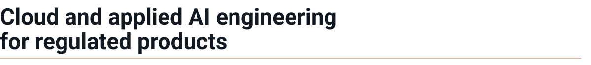
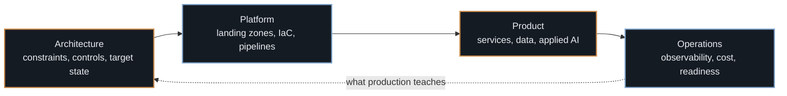
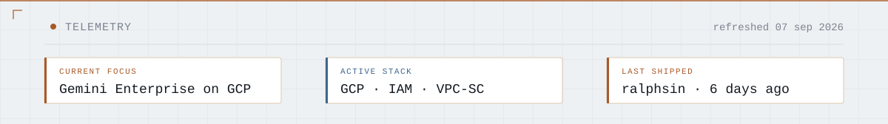

<picture>
  <source media="(prefers-color-scheme: dark)" srcset="./assets/hero/system-map-dark.svg">
  <source media="(prefers-color-scheme: light)" srcset="./assets/hero/system-map-light.svg">
  
</picture>

<picture>
  <source media="(prefers-color-scheme: dark)" srcset="./assets/headings/title-dark.svg">
  <source media="(prefers-color-scheme: light)" srcset="./assets/headings/title-light.svg">
  
</picture>

I help fintech and enterprise teams design, migrate and ship production systems on GCP — combining platform engineering, data systems and applied AI.

  

> **18+ years** in production engineering · **Up to 95%** less deployment effort · **$15M+** cost savings delivered

<picture>
  <source media="(prefers-color-scheme: dark)" srcset="./assets/headings/head-01-start-where-you-are-dark.svg">
  <source media="(prefers-color-scheme: light)" srcset="./assets/headings/head-01-start-where-you-are-light.svg">
  
</picture>

<b>You need a cloud architect</b>

 

You have a migration, a landing zone or a platform that has outgrown its original shape, and you need someone who can hold the whole system in their head while still writing the Terraform.

**What that looks like:** current-state assessment → target architecture and control model → phased migration plan with explicit gates → reference implementation your team can extend.

**Relevant work:** [Gemini Enterprise platform enablement](#gemini-enterprise-platform-enablement--major-uk-telecommunications-enterprise) (GCP landing zone, identity federation, VPC-SC for an enterprise-wide AI rollout), [CloudMorph](#cloudmorph--migration-intelligence) (AWS to GCP migration architecture).

**Typical shape:** 6–12 weeks, architecture ownership plus hands-on delivery.

<b>You are building an AI product</b>

 

You have a promising demo and no path to production — the model is the easy part, and the evaluation, data controls, cost envelope and failure modes are the hard part.

**What that looks like:** structured LLM pipelines with deterministic boundaries → evaluation harness before feature work → schema-aware data access → cost and latency budgets treated as requirements.

**Relevant work:** [Transmute](#transmute--governed-conversational-sql) (text-to-SQL with a validation pipeline), [OpsMorph](#opsmorph--governed-incident-intelligence) (multi-agent incident investigation with a frozen, explainable confidence model), current fintech engagement (LLM-driven insights on GCP).

**Typical shape:** 8–16 weeks, from prototype to something you can put in front of a regulator.

<b>You need someone to actually ship it</b>

 

The design is agreed and the backlog is real. You need throughput from someone who does not need onboarding to be useful.

**What that looks like:** Python and FastAPI services, Terraform, CI/CD, test strategy, observability, and the unglamorous production readiness work that decides whether a launch holds.

**Relevant work:** [VerbaSync](#verbasync--multilingual-dubbing-pipeline) (event-driven pipeline shipped and tested solo), plus the delivery layer of everything above.

**Typical shape:** ongoing, part-time or full-time, remote.

<picture>
  <source media="(prefers-color-scheme: dark)" srcset="./assets/headings/head-02-how-the-pieces-fit-dark.svg">
  <source media="(prefers-color-scheme: light)" srcset="./assets/headings/head-02-how-the-pieces-fit-light.svg">
  
</picture>

Most engagements start at one of these four and pull in the neighbours. The loop back from operations to architecture is the part that usually gets skipped.

<picture>
  <source media="(prefers-color-scheme: dark)" srcset="./assets/headings/head-03-selected-systems-dark.svg">
  <source media="(prefers-color-scheme: light)" srcset="./assets/headings/head-03-selected-systems-light.svg">
  
</picture>

<table>
<tr>
<td width="50%" valign="top">

**CloudMorph** — migration intelligence

Deterministic, phase-gated pipeline mapping AWS serverless to GCP-native services — three human approval gates, not one opaque translation step. **In production** at a global quick-service restaurant chain.

  

</td>
<td width="50%" valign="top">

**Transmute** — governed conversational SQL

Schema-aware NL-to-SQL pipeline with a hard boundary between generation and execution — read-only by construction, PII-masked, cost-gated. **In production** at a global home-furnishings retailer: 30–40% better query accuracy, 40–60% lower LLM cost.

    

</td>
</tr>
<tr>
<td width="50%" valign="top">

**OpsMorph** — governed incident intelligence

Multi-agent investigation (Google ADK) with a frozen, explainable confidence model and deterministic evaluation — governed reasoning, not an open-ended agent loop. **Built for** a major US telecom operator.

    

</td>
<td width="50%" valign="top">

**VerbaSync** — multilingual dubbing pipeline

Event-driven serverless pipeline (Cloud Run + Cloud Tasks), planner → worker → stitcher per stage, two-phase bootstrap solving CI/CD's permission chicken-and-egg problem. **In production** for a global telecom operator: 95%+ test coverage.

    

</td>
</tr>
</table>

*Private source repos — `cloudmorph`, `transmute`, `opsmorph`, `verbasync` — sit behind each case study; access on request.*

<picture>
  <source media="(prefers-color-scheme: dark)" srcset="./assets/headings/head-04-current-engagements-dark.svg">
  <source media="(prefers-color-scheme: light)" srcset="./assets/headings/head-04-current-engagements-light.svg">
  
</picture>

### Gemini Enterprise platform enablement — major UK telecommunications enterprise

**Problem.** Rolling out an enterprise AI platform across a regulated telecom's GCP estate, spanning multiple business units, means clearing identity, security and data-residency gates before a single use case goes live, with legal, privacy and security stakeholders who need to see the reasoning, not just the diagram.

**Approach.** Principal Solution Architect role: GCP landing-zone integration for Gemini Enterprise (IAM, workforce identity federation, VPC Service Controls, Model Armor guardrails, CMEK, audit and observability posture), a governance layer (group-based licence allocation, connector governance, an Umbrella SIA/PIA framework), and adoption/FinOps visibility via Looker Studio — plus a working proof of concept wiring [Transmute](#transmute--governed-conversational-sql)'s existing governed pipeline into the platform as a registered agent, rather than rebuilding its governance from scratch.

**Status.** In delivery. Landing-zone and guardrail architecture cleared enterprise review; licences provisioned across business units; adoption dashboards and reusable architecture patterns in progress. No public repo yet — this is licensing and governance architecture, not a shippable codebase; a sanitised write-up is next once the design settles.

      

### Multi-tenant fintech platform — US fintech

**Problem/Approach.** Building a production-grade, multi-tenant financial application on GCP: LLM-driven insights, real-time pipelines, and infrastructure automation under regulated-data constraints.

       

<picture>
  <source media="(prefers-color-scheme: dark)" srcset="./assets/headings/head-05-telemetry-dark.svg">
  <source media="(prefers-color-scheme: light)" srcset="./assets/headings/head-05-telemetry-light.svg">
  
</picture>

<picture>
  <source media="(prefers-color-scheme: dark)" srcset="./assets/generated/telemetry-dark.svg">
  <source media="(prefers-color-scheme: light)" srcset="./assets/generated/telemetry-light.svg">
  
</picture>

<picture>
  <source media="(prefers-color-scheme: dark)" srcset="./assets/headings/head-06-how-i-engineer-dark.svg">
  <source media="(prefers-color-scheme: light)" srcset="./assets/headings/head-06-how-i-engineer-light.svg">
  
</picture>

     

**Cloud and infrastructure** — GCP, Terraform, Docker, Cloud Build, Linux
**Backend and data** — Python, FastAPI, BigQuery, Firestore, SQLite
**Applied AI** — Gemini, Gemini Enterprise, structured LLM pipelines, text-to-SQL, evaluation
**Frontend** — TypeScript, Next.js, React, Tailwind
**Quality** — pytest, mypy (strict), Ruff, Playwright, Vitest

<picture>
  <source media="(prefers-color-scheme: dark)" srcset="./assets/headings/head-07-contact-dark.svg">
  <source media="(prefers-color-scheme: light)" srcset="./assets/headings/head-07-contact-light.svg">
  
</picture>

Open to selected remote engagements involving cloud platforms, data systems and applied AI.

[**Start a technical conversation →**](mailto:ralphsin@gmail.com?subject=Engineering%20engagement)
