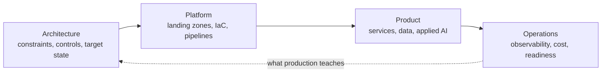

<picture>
  <source media="(prefers-color-scheme: dark)" srcset="./assets/hero/system-map-dark.svg">
  <source media="(prefers-color-scheme: light)" srcset="./assets/hero/system-map-light.svg">
  
</picture>

# Cloud and applied AI engineering for regulated products

I help fintech and enterprise teams design, migrate and ship production systems on GCP — combining platform engineering, data systems and applied AI.

[**Discuss an engagement**](mailto:ralphsin@gmail.com?subject=Engineering%20engagement) · [Selected systems](#selected-systems) · [LinkedIn](https://linkedin.com/in/rakesh-singh09)

> **17+ years** in production engineering · **Up to 95%** less deployment effort · **$15M+** cost savings delivered

---

## Start where you are

<b>You need a cloud architect</b>

 

You have a migration, a landing zone or a platform that has outgrown its original shape, and you need someone who can hold the whole system in their head while still writing the Terraform.

**What that looks like:** current-state assessment → target architecture and control model → phased migration plan with explicit gates → reference implementation your team can extend.

**Relevant work:** [CloudMorph](#cloudmorph--migration-intelligence) (AWS to GCP migration architecture), [VerbaSync](#verbasync--multilingual-dubbing-pipeline) (serverless landing zone, bootstrap/deploy separation).

**Typical shape:** 6–12 weeks, architecture ownership plus hands-on delivery.

<b>You are building an AI product</b>

 

You have a promising demo and no path to production — the model is the easy part, and the evaluation, data controls, cost envelope and failure modes are the hard part.

**What that looks like:** structured LLM pipelines with deterministic boundaries → evaluation harness before feature work → schema-aware data access → cost and latency budgets treated as requirements.

**Relevant work:** [Transmute](#transmute--governed-conversational-sql) (text-to-SQL with a validation pipeline), [OpsMorph](#opsmorph--governed-incident-intelligence) (multi-agent incident investigation with a frozen, explainable confidence model), current fintech engagement (LLM-driven insights on GCP).

**Typical shape:** 8–16 weeks, from prototype to something you can put in front of a regulator.

<b>You need someone to actually ship it</b>

 

The design is agreed and the backlog is real. You need throughput from someone who does not need onboarding to be useful.

**What that looks like:** Python and FastAPI services, Terraform, CI/CD, test strategy, observability, and the unglamorous production readiness work that decides whether a launch holds.

**Relevant work:** [VerbaSync](#verbasync--multilingual-dubbing-pipeline) (event-driven pipeline shipped and tested solo), plus the delivery layer of everything above.

**Typical shape:** ongoing, part-time or full-time, remote.

---

## How the pieces fit

Most engagements start at one of these four and pull in the neighbours. The loop back from operations to architecture is the part that usually gets skipped.

---

## Selected systems

### CloudMorph — migration intelligence

**Problem.** Serverless migration decisions were manual, inconsistent between engineers, and impossible to validate before cutover.

**Approach.** A deterministic, phase-gated pipeline that maps AWS serverless constructs to GCP-native equivalents, with explicit human review points rather than a single opaque translation step.

**Result.** In production at a global quick-service restaurant chain — repeatable migration decisions with an auditable trail, and a sharp drop in the review effort per workload.

`Python 3.12` `SQLite` `Clean Architecture`

[Architecture and decisions](https://github.com/ralphsin/cloudmorph-case-study) · [pinned repo](https://github.com/ralphsin/cloudmorph) (private — access on request)

### Transmute — governed conversational SQL

**Problem.** Natural-language SQL is unreliable in production without schema discovery, validation and a hard boundary between generation and execution.

**Approach.** A schema-aware pipeline that discovers structure, generates reviewable SQL from plain English, validates it, and never lets the model execute directly.

**Result.** In production at a global home-furnishings retailer — analyst-grade queries from non-technical users, with the review step preserved rather than automated away.

`Python` `FastAPI` `Next.js` `Gemini` `GCP`

[Architecture and decisions](https://github.com/ralphsin/transmute-case-study) · [pinned repo](https://github.com/ralphsin/transmute) (private — access on request)

### OpsMorph — governed incident intelligence

**Problem.** Incident evidence is scattered across GitHub, Jira, logs and metrics, and reconstructing root cause is manual, slow and rarely documented anywhere reusable.

**Approach.** Multi-agent investigation (Google ADK) with a frozen, explainable confidence model, immutable investigation snapshots, and deterministic evaluation against a golden benchmark — governed reasoning, not an open-ended agent loop.

**Result.** Built for a major US telecom operator — investigations that replay identically and carry an auditable confidence score per finding, with every downstream enrichment layer (memory, topology, noise suppression) advisory rather than load-bearing.

`Python` `FastAPI` `Google ADK` `Vertex AI (Gemini)` `Firestore`

[Architecture and decisions](https://github.com/ralphsin/opsmorph-case-study) · [pinned repo](https://github.com/ralphsin/opsmorph) (private — access on request)

### VerbaSync — multilingual dubbing pipeline

**Problem.** Turning long-form video into accurately translated, timing-correct dubbed output means chaining transcription, translation and synthesis without a human re-checking every handoff.

**Approach.** An event-driven, serverless pipeline (Cloud Run + Cloud Tasks) with a repeating planner → worker → stitcher pattern per stage, idempotent workers, and a two-phase bootstrap/deploy split that solves CI/CD's permission chicken-and-egg problem.

**Result.** In production for a global telecom operator, delivered through a systems-integrator partnership — a validated transcription and translation pipeline (95%+ test coverage), with voice synthesis next on the roadmap.

`Python` `FastAPI` `Cloud Run` `Cloud Tasks` `Terraform`

[Architecture and decisions](https://github.com/ralphsin/verbasync-case-study) · [pinned repo](https://github.com/ralphsin/verbasync) (private — access on request)

---

## Current engagement

Building a production-grade, multi-tenant financial application on GCP for a US fintech: LLM-driven insights, real-time pipelines, and infrastructure automation under regulated-data constraints.

`Python` `FastAPI` `Gemini` `Cloud Run` `Firestore` `BigQuery` `Terraform` `Next.js`

---

## Telemetry

<picture>
  <source media="(prefers-color-scheme: dark)" srcset="./assets/generated/telemetry-dark.svg">
  <source media="(prefers-color-scheme: light)" srcset="./assets/generated/telemetry-light.svg">
  
</picture>

---

## How I engineer

`Deterministic where possible` · `Observable by design` · `Infrastructure as code` · `Secure defaults` · `Explicit quality gates` · `Simple operational models`

**Cloud and infrastructure** — GCP, Terraform, Docker, Cloud Build, Linux
**Backend and data** — Python, FastAPI, BigQuery, Firestore, SQLite
**Applied AI** — Gemini, structured LLM pipelines, text-to-SQL, evaluation
**Frontend** — TypeScript, Next.js, React, Tailwind
**Quality** — pytest, mypy (strict), Ruff, Playwright, Vitest

---

## Contact

Open to selected remote engagements involving cloud platforms, data systems and applied AI.

[**Start a technical conversation →**](mailto:ralphsin@gmail.com?subject=Engineering%20engagement)
